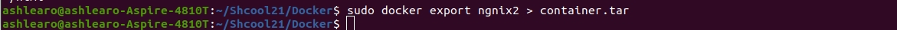
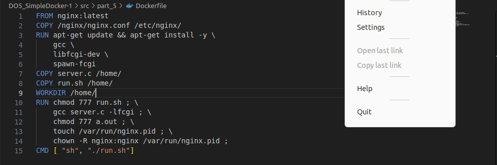

## Part 1. Готовый докер
В качестве конечной цели своей небольшой практики вы сразу выбрали написание докер образа для собственного веб сервера, а потому в начале вам нужно разобраться с уже готовым докер образом для сервера.
Ваш выбор пал на довольно простой nginx.
== Задание ==


Взять официальный докер образ с nginx и выкачать его при помощи docker pull


Проверить наличие докер образа через docker images


Запустить докер образ через docker run -d [image_id|repository]


Проверить, что образ запустился через docker ps


Посмотреть информацию о контейнере через docker inspect [container_id|container_name]


По выводу команды определить и поместить в отчёт размер контейнера, список замапленных портов и ip контейнера


Остановить докер образ через docker stop [container_id|container_name]


Проверить, что образ остановился через docker ps


Запустить докер с портами 80 и 443 в контейнере, замапленными на такие же порты на локальной машине, через команду run


Проверить, что в браузере по адресу localhost:80 доступна стартовая страница nginx

Перезапустить докер контейнер через docker restart [container_id|container_name]

Проверить любым способом, что контейнер запустился


## Part 2. Операции с контейнером

Докер образ и контейнер готовы. Теперь можно покопаться в конфигурации nginx и отобразить статус страницы.
== Задание ==

** создание нового контейнера с именем ngnix2 


### 2.1  Прочитать конфигурационный файл nginx.conf внутри докер контейнера через команду exec

### 2.2  Создать на локальной машине файл nginx.conf

### 2.3  Настроить в нем по пути /status отдачу страницы статуса сервера nginx

### 2.4  Скопировать созданный файл nginx.conf внутрь докер образа через команду docker cp

### 2.5  Перезапустить nginx внутри докер образа через команду exec

### 2.6  Проверить, что по адресу localhost:80/status отдается страничка со статусом сервера nginx

### 2.7  Экспортировать контейнер в файл container.tar через команду export

### 2.8  Остановить контейнер

### 2.9  Удалить образ через docker rmi [image_id|repository], не удаляя перед этим контейнеры

### 2.10  Удалить остановленный контейнер

### 2.11  Импортировать контейнер обратно через команду import

### 2.12  Запустить импортированный контейнер

### 2.13  Проверить, что по адресу localhost:80/status отдается страничка со статусом сервера nginx


## Part 3. Мини веб-сервер
### 3.1 Написать мини сервер на C и FastCgi, который будет возвращать простейшую страничку с надписью Hello World!

### 3.2 Написать свой nginx.conf, который будет проксировать все запросы с 81 порта на 127.0.0.1:8080

### 3.3 Запустить написанный мини сервер через spawn-fcgi на порту 8080

Последоватлеьность действий:
``` brew
docker pull nginx
docker images
docker run -d -p 81:81 [IMAGE_ID]
docker ps
```

``` brew
docker cp nginx.conf [CONTAINER ID]:/etc/nginx/
docker cp server.c [CONTAINER ID]:/home/
docker exec -it [CONTAINER ID] bash     // чтобы подключиься к контейнеру
```

``` brew
apt-get update
apt-get install gcc
apt-get install spawn-fcgi
apt-get install libfcgi-dev
gcc *.c -lfcgi
spawn-fcgi -p 8080 /image/a.out
nginx -s reload
```


### 3.4 Проверить, что в браузере по localhost:81 отдается написанная вами страничка
``` brew
curl localhost:81
```


## Part 4. Свой докер
### 4.1 Написать свой докер образ, который:

1) собирает исходники мини сервера на FastCgi из Части 3

2) запускает его на 8080 порту

3) копирует внутрь образа написанный /image/nginx/nginx.conf

4) запускает nginx.


### 4.2 Собрать написанный докер образ через docker build при этом указав имя и тег


### 4.3 Проверить через docker images, что все собралось корректно


### 4.3 Запустить собранный докер образ с маппингом 81 порта на 80 на локальной машине и маппингом папки /image/nginx внутрь контейнера по адресу, где лежат конфигурационные файлы nginx'а (см. Часть 2)


### 4.4 Проверить, что по localhost:80 доступна страничка написанного мини сервера


### 4.5 Дописать в /nginx/nginx.conf проксирование странички /status, по которой надо отдавать статус сервера nginx


### 4.6 Перезапустить докер образ


### 4.7 Проверка, что теперь по *localhost:80/status* отдается страничка со статусом **nginx**


## Part 5. Dockle  

### 5.1 Установка утилиты dockle


### 5.2 Просканировать образ из предыдущего задания через dockle [image_id|repository]
``` brew
команда dockle -i CIS-DI-0010 r:r
```



### 5.3 Исправить образ так, чтобы при проверке через dockle не было ошибок и предупреждений


## Part 6. Базовый Docker Compose
### 6.1 Написать файл docker-compose.yml, с помощью которого:
1) Поднять докер контейнер из Части 5 (он должен работать в локальной сети, т.е. не нужно использовать инструкцию EXPOSE и мапить порты на локальную машину)
2) Поднять докер контейнер с nginx, который будет проксировать все запросы с 8080 порта на 81 порт первого контейнера


### 6.2 Замапить 8080 порт второго контейнера на 80 порт локальной машины


### 6.3 Собрать и запустить проект с помощью команд docker-compose build и docker-compose up


### 6.4 Проверить, что в браузере по localhost:80 отдается написанная вами страничка, как и ранее


